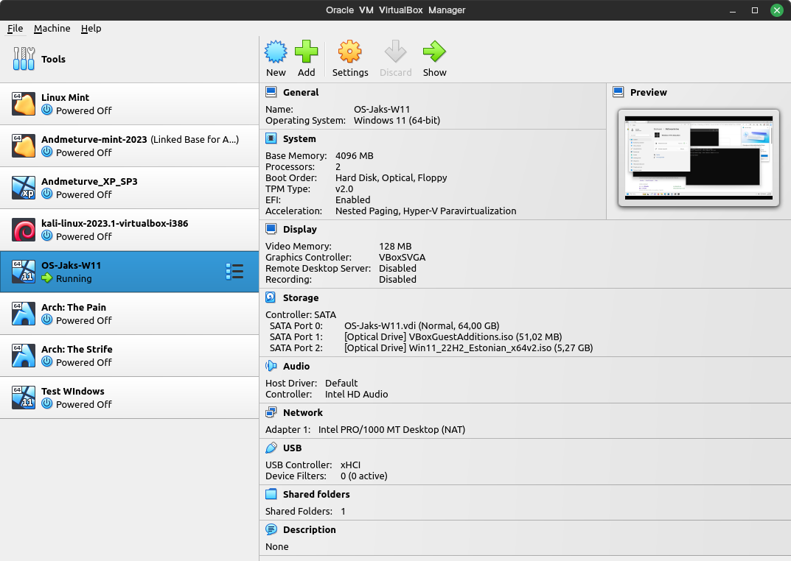
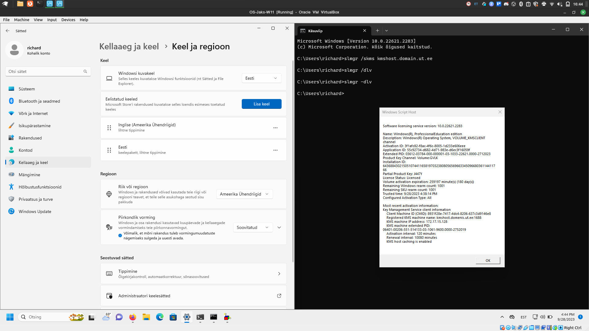

# Praktikum 1

## Virtuaalmasina seadistamine
VirtualBox 7.0 oli eelnevalt alla laetud, aga teadmatus sellest, et see on võimeline osa Windowsi installimisiest ise ära tegema, siis ma algul sattusin mitmete juhendi osadega segadusse. Kokku laadisin 3 korda Windowsit uuesti lihtsalt selleks, et aru saada, et tegelikult tegin kõik õigesti.

## Windowsi paigaldamine
Virtual Box 7.0 tegi suurem osa tööst minu eest ära siin, peale installeerimist kontrollisin andmete õigsust. regediti tegevused oli VirtualBox minu eest juba ära teinud. Probleem hakkas tekkima siis, kui üritasin snapshoti masinast teha, kus ta ei suutnud kopeerida loodud jagatud kausta. Snapshoti tegemine viskas nii antud Windows masinal, kui ka ülejäänud virtuaalmasinatel VARR\_INVALID\_PARAMETER errori. Seetõttu ma ei saanud teha teatud punkte, mis on seotud snapshotiga.

## Testid ja muu
### Ekraanitõmmised
Kui PRNTSCRN teeb ekraanitõmmise tervest ekraanist, siis ALT+PRNTSCRN teeb ekraanitõmmise vaid aktiivsest aknast. Snipping tool, mida saab ka kasutada klahvikombinatsiooni SHIFT+WIN+S, teeb ekraanitõmmise valitud alast.

### Väiksemad tegevused
* Ninitei abil said mainitud programmid, pluss veel mõned lisad (.NET, OpenJDK, GIMP) alla laetud.
* Clipboard History sai ilusti sisse lülitatud
* Tegumiriba sai vasakule joondatud
* CTRL nüüd näitab kursori asukohta
* Inglise keel oli juba mul kuidagi olemas.
* Firefoxi sai lisatud küll tegumiribale
* Kasutaja richard-tava sai lisatud
* Sai paigaldatud ka ZoomIT

## Windowsi aktiveerimine
Peale võtme saamist üritasin aktiveerida Windowsi, aga kahjuks GlobalProtect VPN-ga ei saanud aktiveerida. Õnneks aga olles ülikoolis ja kasutades antud käsku õnnestus aktiveerida.

