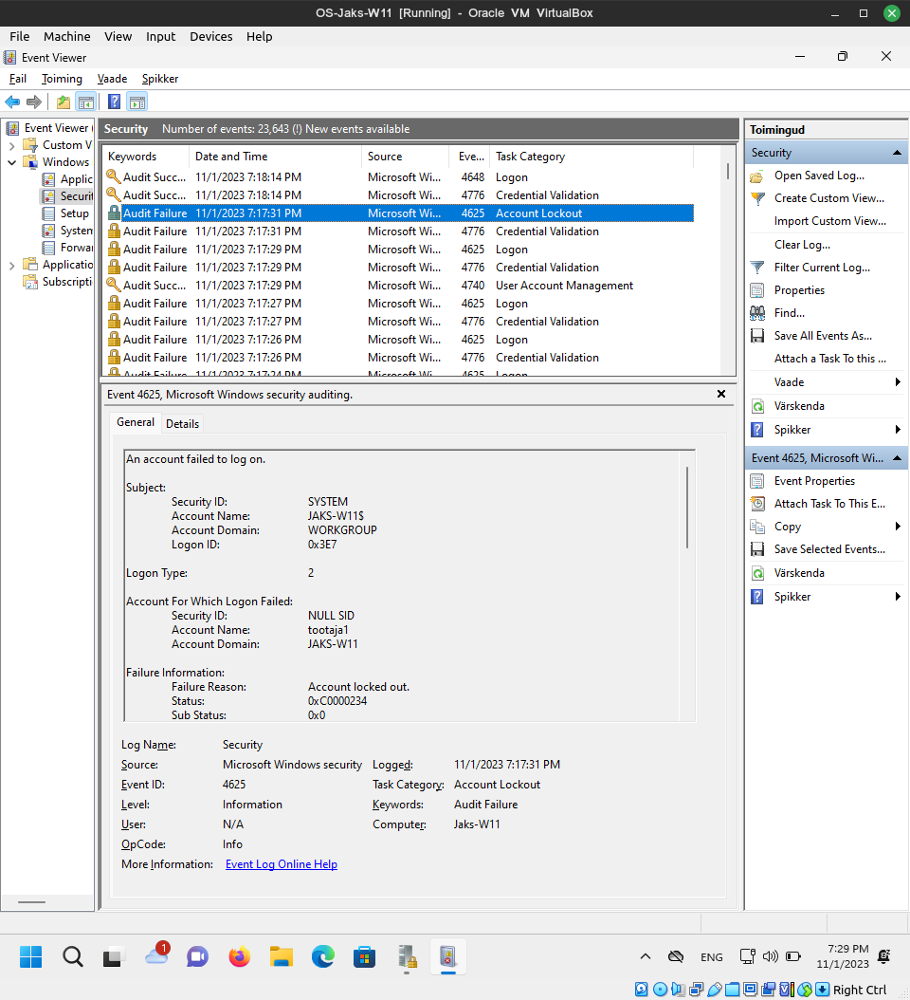

Alustuseks ma olin samuti parooli ära unustanud, seega tuletasin andmeturbe kursust meelde ja murdsin tuimalt sisse kasutades sticky keys asemel command prompti.

# Praktikum 4
## 4-1. Windows update
Ootamine...
Ootamine...
Ootamine...
Ootamine...
Ootamine...
uuendatud.

## 4-2. Windows Defender
Firefox lasi mõlemaid faile lihtsalt alla laadida, edge hoiatas ega lasnud isegi esimeste failide saitidele

## 4-3. Tulemüür
Jah.

## 4-4. Kasutaja õigused vs privileegid
Olen tõesti enda arvuti ära krüpteerinud. Kui poleks siis saaks suhteliselt kergesti füüsilist ligipääsu omades sellele ligi.

whoami tavalises ja admin käsuviibal andis sama väljundi, aga psexec käsuviibal andis süsteemi oma
priv väljaga iga korraga näitas aina rohkem õigusi mis eksisteerivad, mõned enabled, mõned disabled

Süsteemiõigusi läheb vaja süsteemi kallal tegelemiseks. Näiteks süsteemiteenuste opereerimiseks, või süsteemifailide muutmiseks.

## 4-5. Windowsi kausta- ja failiõigused
Tegin 2 kausta, vastavalt üks töötajatest saab ligi aga teine ei saa, ning ülemus saab lugeda.

## 4-6. Windows 11 turbe- ja privaatsussätted
Mul soovitab päris mitut asja teha, aga ise valin välja, et soovitab mul seada üles andmete backup OneDrive'ga et kui ransomware rünnak tuleb siis saaks failid ikka kätte.

## 4-7. Windowsi turvapoliitikad ja -mallid (Group Policy)

## 4-8. Testimine
Edukas. Sai Thonny paigaldatud.

## 4-9. Turbelogid
Võttis tsipa aega, aga leidsin üles

## 4-10. Windowsi registri muutmine
Sain musta ekraani toreda sõnumiga.

