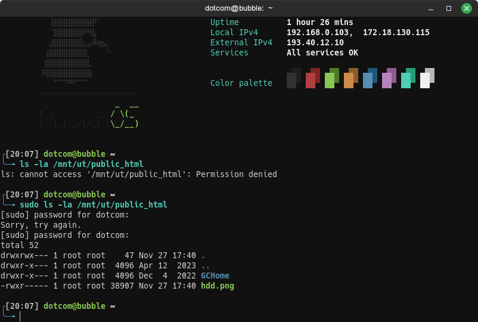
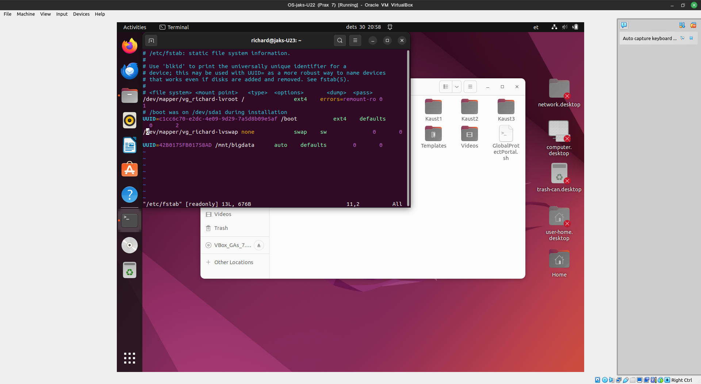

# Praktikum 7 - Haakimine
Sain ketta lisatud, W11 snapshoti ei saanud tehtud, kuna nvram INVALID\_PARAMETER\_ERROR

# Tulemus
1. Andmekandjad vajavad lähtestamist, sest nendel algselt kas pole või võib olla vigane failisüsteem. Samuti kasutatav failisüsteem ei pruugi olla operatsioonsüsteemi poolt tõlgendatav, seega see vajab uut failisüsteemi, millega operatsioonsüsteem hakkama saab.
2. GPT eelised MBR-i ees
    * GPT toetab suuremaid draive kui 2TB, 
    * sellele saab teha lõpmatult partitsioone erinevalt MBR-ist, millel saab olla vaid 4 esmast partitsiooni
    * GPT on ühilduvam modernsete süsteemidega kui MBR

5. `mount o -ro` remountib read-only õigustes, `mount -t auto` automaatselt valib failisüsteemi
6. Minul peaks auto asenduma ext4-ga, kuna see on minu usb andmekandja failisüsteem.

