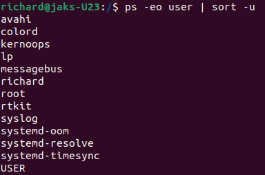
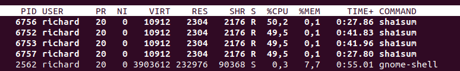

| Küsimus                           | Linux     | Windows       | Linuxi käsk       | Windowsi tööriist     |
|-----------------------------------|-----------|---------------|-------------------|-----------------------|
| Mitu protsessi arvutis käivitub?  | 213       | 130           | `ps -eo cmd \|  wc -l`| Task Manager > jõudlus > CPU             |
| Esimesena käivitatud protsess     | `/sbin/init bash`| Registry| `ps -eo bsdstart,args \| head -n 2 | tail -n 1` | Process Explorer > Üksikasjad > Start Time  |
| Mis kasutajate protsessid käivad  |  | DWM-1, LOCAL SERVICE, NETWORK SERVICE, richard, SYSTEM, UMFD-0, UMFD-1 | `ps -eo user \| sort -u` | Task Manager > Üksikasjad > Kasutajanimi|
| Arvuti uptime                     | 49 minutit | 00:17:45      | `w`              | Task Manager > Jõudlus > CPU |
| Viimasena käivitatud protsess     | `[kworker/1:2]` | `SecurityHealthService.exe` | `ps -eo bsdstart,cmd \| tail -n 4| head -n 1`                       | Process Explorer > Start Time | 
| Enim CPU-aega võttev protsess     | `gnome-shell` | `System idle process`| top > Shift + F > TIME+ > Kõige ülemine | Process Explorer > CPU Time |
| Kõige rohkem virtuaalmälu võttev  | `gnome-shell` | `Taskmgr.exe` / `explorer.exe` | `top` > Shift + F > VIRT > kõige ülemine | Task Manager > Üksikasjad > Saalitav mälu |
| Kõige rohkem füüsilist mälu võttev| `firefox`     | `MsMpEng.exe` | `top` > Shift + F > MEM% | Task Manager > Üksikasjad > Mälu (aktiivne isiklik töökomplekt)|
| Vaba füüsilist mälu               | 236MB     | 1.2 GB        | `free -m`          | Task Manager > Üksikasjad > Mälu (aktiivne isiklik töökomplekt) |
| Põhiketta ruum (GB ja %)          | 11 GB     | 31.1 GB / 48.6%                  | Sätted > See Arvuti   |
| Suurim fail ja alamkaust          | `/usr/` `/usr/bin/gdb` | - | `sudo du -h 2>&1 \| grep -v "du: cannot access" \|sort -k1 -r \| head -n 1` `sudo find / -type f -print0 \| sudo du -h --files0-from=- 2>&1 \| grep -v "cannot access" \| grep -v "permission denied" \| sort -k1 -r \| head -n 1` | - |
| Võrdle /dev/zero ja /dev/urandom  | Praktiliselt identne, jooksutasin mõlemat korraga  | -             |                  | -                     |
| Milline protsess kirjutab enim    | -         | System        | -                | Resource Monitor > Disk > Write |
| Mis faili?                        | -         | c:\pagefile.sys | -              | Resource Monitor > Disk > File |
| Milline protsess loeb enim        | -         | System / MsMpEng.exe | -         | Resource Monitor > Disk > Read |
| Mis failist?                      | -         |  C:\Program\Files\NextCloud\Qt5Gui.dll | - | Resource Monitor > Disk > File |
| Milline protsess tektab suurimat võrguliiklust? | - | nextcloud.exe, IP, Port: 10.0.2.15:49900 , Teise poole IP, Port: 193.40.5.90:443, Latents: 0ms, Võrguliikluse maht: 193 B/s| -                 |  |

15. Kuidas aru saada miks arvuti on oluliselt aeglasemaks muutunud.
    * Windowsis esimene asi mille ma lahti võtaks on task manager ja vaataks, mis sealt enim kasutab protsessorit spetsiifiliselt. Harva on põhjuseks RAMi puudus, aga kui see on punases vaatan ka seda.
    * Kui Task Managerist välja ei tule, vaatan Resource Monitorist. Kui sealt leiab suurkasutajad siis lahendab selle läbi.
    * Oleneb ka mis on aeglane. Teinekord võib probleem olla aegunud riistvaras, näiteks enam kui 5 aastat vana HDD, või vana protsessor. Mõnikord ka on valed sätted või puuduvad draiverid.
        * Sellega seoses vaataks ka draivi kirjutusi
    * Kui protsessori uptime on päevades, kuudes, või hoia jumal, aastates, lülitaks kohe Quick Starti välja.
