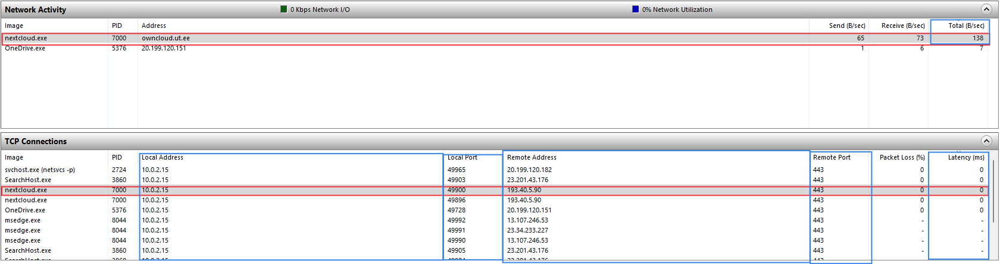

| Küsimus                           | Linux     | Windows       | Linuxi käsk       | Windowsi tööriist     |
|-----------------------------------|-----------|---------------|-------------------|-----------------------|
| Mitu protsessi arvutis käivitub?  |           | 130           |                   | Task Manager > jõudlus > CPU          |
| Esimesena käivitatud protsess     |           | Registry |  | Process Explorer > Üksikasjad > Start Time |
| Mis kasutajate protsessid käivad  |           | DWM-1, LOCAL SERVICE, NETWORK SERVICE, richard, SYSTEM, UMFD-0, UMFD-1 |         | Task Manager > Üksikasjad > Kasutajanimi |
| Arvuti uptime                     |           | 00:17:45      |                   | Task Manager > Jõudlus > CPU |
| Viimasena käivitatud protsess     |           | SecurityHealthService.exe |       | Process Explorer > Start Time| 
| Enim CPU-aega võttev protsess     |           | System idle process |             | Process Explorer > CPU Time |
| Kõige rohkem virtuaalmälu võttev  |           | Taskmgr.exe / explorer.exe |      | Task Manager > Üksikasjad > Saalitav mälu |
| Kõige rohkem füüsilist mälu võttev|           | MsMpEng.exe   |                   | Task Manager > Üksikasjad > Mälu (aktiivne isiklik töökomplekt) |
| Vaba füüsilist mälu               |           | 1.2 GB        |                   | Task Manager > Üksikasjad > Mälu (aktiivne isiklik töökomplekt) |
| Põhiketta ruum (GB ja %)          |           | 31.1 GB /                         | Sätted > See Arvuti   |
| Suurim fail ja alamkaust          |
| Võrdle /dev/zero ja /dev/urandom  |           | -             |                   | -                     |
| Milline protsess kirjutab enim    | -         | System        | -                 | Resource Monitor > Disk > Write |
| Mis faili?                        | -         | c:\pagefile.sys | -               | Resource Monitor > Disk > File |
| Milline protsess loeb enim        | -         | System / MsMpEng.exe | -          | Resource Monitor > Disk > Read |
| Mis failist?                      | -         |  C:\Program\Files\NextCloud\Qt5Gui.dll | - | Resource Monitor > Disk > File |
| Milline protsess tektab suurimat võrguliiklust? | - | nextcloud.exe, IP, Port: 10.0.2.15:49900 , Teise poole IP, Port: 193.40.5.90:443, Latents: 0ms, Võrguliikluse maht: 193 B/s| -                 |  |

15. Kuidas aru saada miks arvuti on oluliselt aeglasemaks muutunud.
